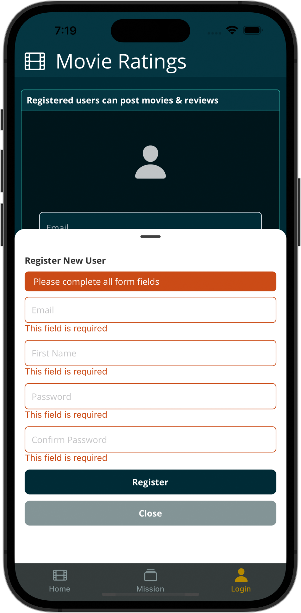

React Native, using Mobx

# react-native-mobx-movies

A work in progress. Exploring the [movies React](https://github.com/adrian-rosario/django-react-movies) project in Expo / React Native, utilizing the same Django API endpoints, Mobx, Google fonts, React Native Vector Icons, ScrollView, Bootswatch Solar theme.

To note, the Django server must be run with:

```bash
python manage.py runserver 0.0.0.0:8000
```

and edit the `/react-native-mobx/src/common/common_constants.js` file for the local IP address:

```bash
  BASE_URL: "http://192.0.0.0:8000", // use local ip address
```

<div style="text-align:center">





</div>
